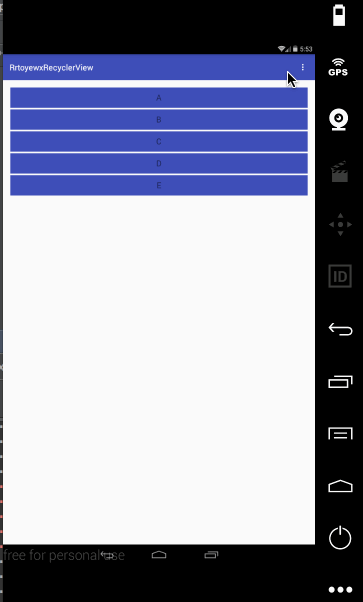
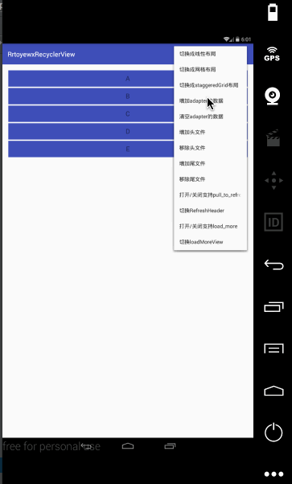
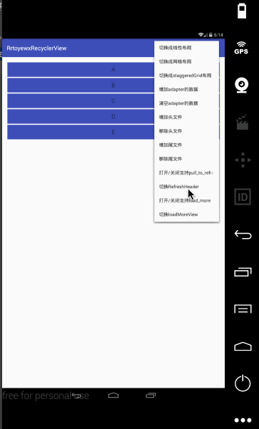

# RrtoyewxRecyclerView


# How to use
maven
```
<dependency>
  <groupId>com.rrtoyewx.rrecyclerview</groupId>
  <artifactId>recyclerviewlibrary</artifactId>
  <version>1.0.0</version>
  <type>pom</type>
</dependency>
```
gradle
```
compile 'com.rrtoyewx.rrecyclerview:recyclerviewlibrary:1.0.0'
```

# What can you do use it
```
setEmptyView(View view);

addHeaderView(View headerView);

removeHeaderView(View headerView);

addFooterView(View headerView);

removeFooterView(View footerView);

setLoadMoreEnabel(boolean loadMoreEnable);
setLoadMoreView(View loadMoreView);

setRefreshHeaderEnable(boolean refreshHeaderEnable);
setRefreshHeader(RefreshHeader header);//ImageRefreshHeader|ArrowRefreshHeader

```

# 更新日志
1. 2016.8.8 17:00 
    完成能够addHeaderView和addFooterView();
2. 2016.8.8 18:50
    - 完成removeHeaderView和removeFooterView();
    - 完成setEmptyView();
    - 修复在设置完LayoutManager后改变LayoutManager，headerView和footerView不占一行的bug;
3. 2016.8.9 18:00
    - 完成加载更多功能
4. 2016.8.9 18:45
    - 修复当页面数据较少的时候，下拉也会出先加载更多view的bug;
5. 2016.8.18 18:42
    - 完成下拉刷新的功能，实现一种最简单的带箭头的下拉刷新;
    - 代码重构第一次;
    - 修复下拉刷新和加载更多手势不对的bug;
    - 下拉刷新和加载更多只能出现一种;
6. 2016.8.19 10:31
    - 完成ImageRefreshHeader;
    - 完成能够切换RefreshHeader;
7. 2016.8.19 11:40
    - 重构exampleActivity 便于测试
8. 2016.8.19 12:00 系统测试
    - mRefreshEnable为false，滑动时崩溃;
    - 当数据为空的时候setOverScrollMode为OVER_SCROLL_NEVER,后有数据的时候无法切换原来的;
    - 新增removeAllHeaderView和removeAllFooterView方法;
    - 新增checkPullToRefreshEnable和getPullToRefreshHeader()方法;
    - 优化onTouchEvent()在mRefreshEnable为false的时候频繁计算;
    - 修复refreshHeader的时间显示错误;
    - 修复打开refreshEnableFlag的adapter的数据不对;
    - 增加checkIsPullRefresh的方法检查是否正在下拉刷新;
    - 解决数据较少的下拉刷新和加载更多冲突的bug;
    - 数据充满整个屏幕的时候，加载更多需要第二次上滑才能显示出来;
    - 修复setLoadMoreView必须在setLoadMoreEnable后调用的bug;
9. 2016.8.21 17:50 第一次系统的测试结束

---
# 支持的功能
1. setEmptyView：自动根据Adapter的item的个数显示空白页;
```
    
    //设置空白的EmptyView
    public void setEmptyView(View emptyView) {...} 
```
效果图：

  
2. headerView的操作：addHeaderView,removeHeaderView,removeAllHeaderView;
    ```
    //addHeaderView
    public void addHeaderView(View headerView) {...}
    
   //removeHeaderView
    public void removeHeaderView(View headerView) {...}
    
    //removeAllHeaderView
    public void removeAllHeaderView() {...}
    ```
效果图：


3. footerView的操作：addFooterView,removeFooterView,removeAllFooterView;
    ```
    //addFooterView
    public void addFooterView(View footerView) {...}
    
   //removeFooterView
    public void removeFooterView(View footerView) {...}
    
    //removeAllFooterView
    public void removeAllFooterView() {...}
    ```
效果图：


4. 下拉刷新：setPullToRefreshEnable, setPullToRefreshHeader
    ```
    //setPullToRefreshEnable:默认是关闭状态
     public void setPullToRefreshEnable(boolean mRefreshEnable) {...}
     
     //setPullToRefreshHeader：实现imageRefreshHeader和ArrowRefreshHeader，默认是ArrowRefreshHeader
     //自定义RefreshHeaderView的需实现BaseRefreshHeader即可
     public void setPullToRefreshHeader(BaseRefreshHeader header){...}
    ```
效果图：


5. 加载更多：setLoadMoreView,setLoadMoreEnable
   ```
    // setLoadMoreEnable:默认是关闭
    public void setLoadMoreEnable(boolean loadMoreEnable) {...}
   
   //setLoadMoreView
   public void setLoadMoreView(View loadMoreView) {...}
   ```
效果图：


6. 设置加载更多和下拉刷新的监听 addRefreshListener
    ```
    //addRefreshListener
    public void addRefreshListener(RefreshDataListener refreshListener) {...}
    
    //RefreshDataListener
    public interface RefreshDataListener {
            void onRefresh();
    
            void onLoadMore();
     }
     
    ```
    
使用例子
   ```
    mRecyclerView.addRefreshListener(new RrtoyewxRecyclerView.RefreshDataListener() {
               @Override
               public void onRefresh() {
                   mRecyclerView.postDelayed(new Runnable() {
                       @Override
                       public void run() {
                           mRecyclerView.completeRefresh();
                           Toast.makeText(ExampleActivity.this, "下来刷新加载完成", Toast.LENGTH_SHORT).show();
                       }
                   }, 2000);
               }
   
               @Override
               public void onLoadMore() {
                   mRecyclerView.postDelayed(new Runnable() {
                       @Override
                       public void run() {
                           mRecyclerView.completeLoadMore();
                           Toast.makeText(ExampleActivity.this, "加载完成", Toast.LENGTH_SHORT).show();
                       }
                   }, 2000);
               }
           });
   ```
   
7. 完成下拉刷新和加载更多
   ```
   //completeLoadMore
   public void completeLoadMore() {}
   
   //completeRefresh
   public void completeRefresh() {...}
           
   ```
   
 
   
